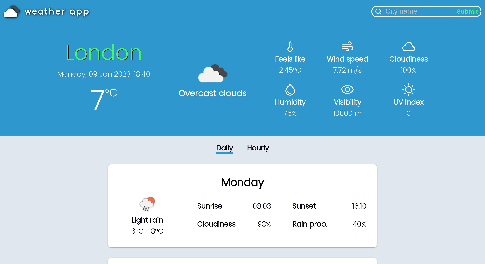

  

  A weather app that consumes the OpenWeatherMap API.

  Built with TypeScript and CSS, with zero production dependencies.

  

  <a href="https://mateusmtoledo.github.io/weather-app/">Live demo</a>

  

## Features

- Responsive design
- Search by location
- Current, Daily and Hourly forecasts

## Setup

1.  Clone this repository.
2.  Open a terminal and navigate into the root directory of your local repository.
3.  Install dependencies:

        npm install

4.  Start the app:

        npm start

The application will be available at http://localhost:8080/.
